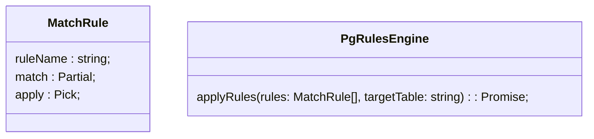

# pg-rules

PostgreSQL based rule engine

## Features

- Rule engine based on PostgreSQL
- Rules are executed directly in the database
- Currently only `MatchRule` is supported

## Class Diagram

### How it works?

1. Rules are transformed into SQL queries using `kysely`
2. Queries are executed in the database based on match conditions: `UPDATE {target_table} SET {apply} WHERE {match}`
3. All queries are executed in a single transaction